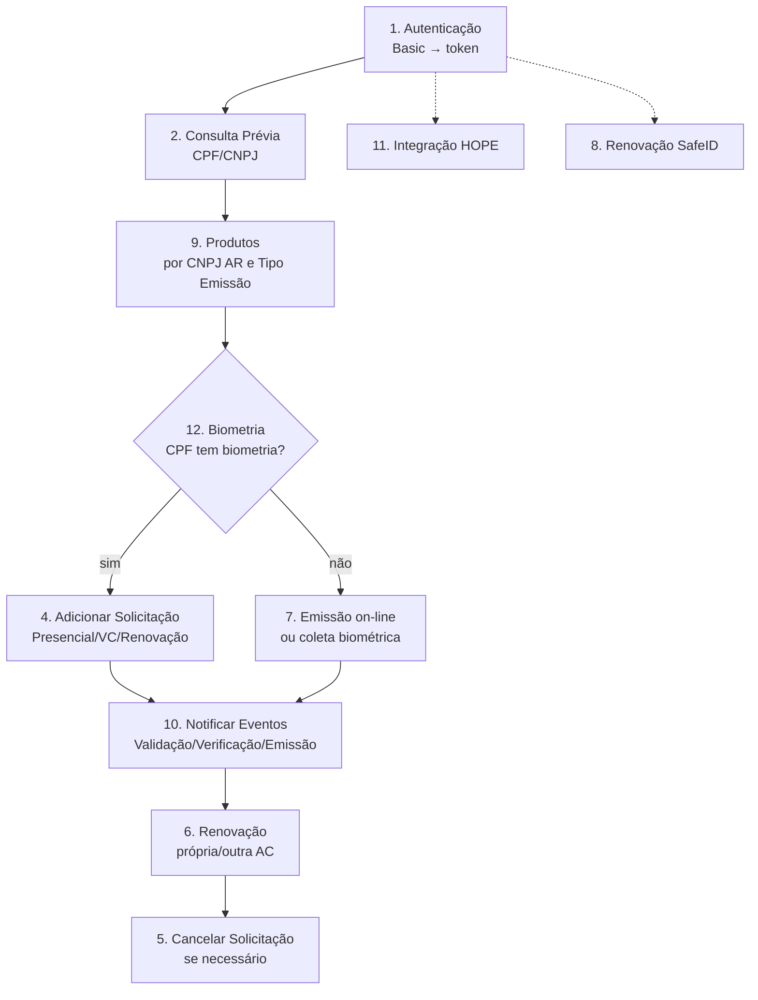

Guia de Uso das APIs Safeweb (Itens 1–12)

Pré‑requisitos

- Authorization: token obtido via autenticação (JWT, validade curta)
- Base URL: https://pss.safewebpss.com.br
- Credenciais da AC para Basic Auth

Fluxo (alto nível)

Como usar cada item (resumo prático)

1) Autenticação

- Objetivo: Obter tokenAcesso via Basic Auth
- Endpoint: POST /Service/Microservice/Shared/HubAutenticacao/Autenticacoes/api/autorizacao/token
- Headers: Authorization: Basic {base64(usuario:senha)}
- Retorno (sucesso): { tokenAcesso, expiraEm }

2) Consulta Prévia

- Objetivo: Validar dados antes da solicitação (CPF/CNPJ)
- Requer: Header Authorization com token

3) Locais de Atendimento

- Objetivo: Localizar locais por IBGE ou por CNPJ da AR
- Requer: Header Authorization com token

4) Adicionar Solicitação

- Objetivo: Criar solicitação conforme o tipo
- Tipos: Presencial, Renovação própria, Renovação outra AC, Videoconferência
- Parâmetro chave: idTipoEmissao (1=Presencial, 2=Renovação on-line, 3=Videoconferência)
- Requer: Header Authorization com token

5) Cancelar Solicitação

- Objetivo: Cancelar protocolo ainda não emitido (da própria AR)
- Obrigatório: Protocolo e CNPJ da AR
- Observação: idJustificativa 4 fixo

6) Renovação

- Objetivo: Renovar certificado (com produto ou outra AC)
- Subfluxos: liberação de renovação, renovação com produto, renovação de outra AC
- Requer: Header Authorization com token

7) Emissão on-line

- Objetivo: Emissão 100% on-line (com produto ou outra AC); inclui liberação
- Requer: Header Authorization com token

8) Renovação SafeID

- Objetivo: Renovação via SafeID (validar certificado, obter produtos, incluir solicitações/período de uso)
- Requer: Header Authorization com token

9) Produtos

- Objetivo: Listar produtos por CNPJ da AR e tipo de emissão
- Endpoint: GET /Service/Microservice/Shared/Product/api/GetListProdutoByAR/{idTipoEmissao}/{CnpjAR}
- Header: Authorization: Bearer {token}

10) Notificar Eventos

- Objetivo: Receber webhooks sobre mudança de status (Validação, Verificação, Emissão, Revogação)
- A AC fornece uma URL HTTPS que aceite POST com JSON e responda HTTP 2xx

11) Integração HOPE

- Objetivo: Fluxos com o HOPE (ex.: primeira emissão)
- Observação: segue usando Authorization Bearer conforme documentação do HOPE

12) Biometria

- Objetivo: Verificar se o CPF tem biometria cadastrada
- Opções:
  - ValidateBiometry (GET):
    - GET /Service/Microservice/Shared/Partner/api/ValidateBiometry/{CPF}
    - Header: Authorization (token)
    - Retorno: true | false
  - PSBio Local (POST):
    - POST /Service/Microservice/Shared/Partner/api/psbio/consulta/biometria/local
    - Header: Authorization: bearer {token}, Content-Type: application/json
    - Body: { "cpf": "99999999999" }
    - Retorno: { "encontrado": true|false }
  - PSBio Global (POST):
    - POST /Service/Microservice/Shared/Partner/api/psbio/consulta/biometria/global
    - Mesmo padrão do Local

Boas práticas

- Reautentique ao expirar o token; centralize a troca de token
- Valide dados de entrada antes de criar solicitações (Consulta Prévia, Biometria)
- Registre logs padronizados e trate erros de forma uniforme
- Teste integrações críticas (produtos, adicionar/emitir, renovar, notificação)

